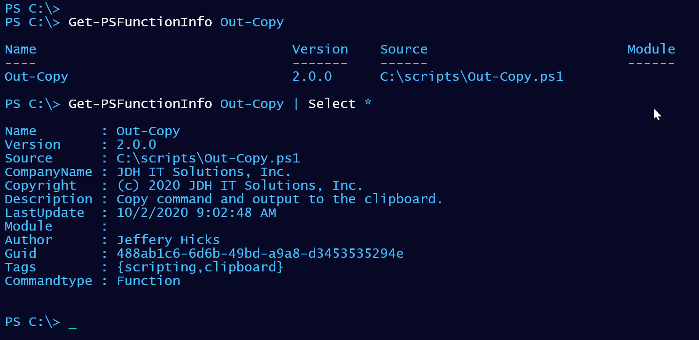
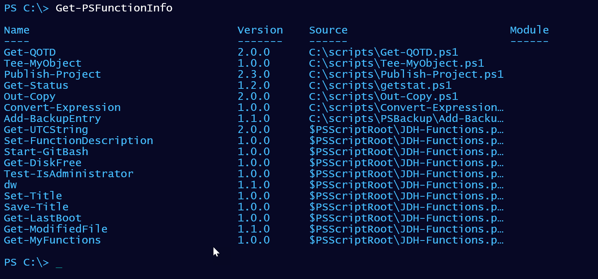

# PSFunctionInfo

## Synopsis

This module contains a set of PowerShell commands to add and manage metadata in stand-alone PowerShell functions.

## Description

The purpose of this code is to provide a way to get version and other metadata information for functions loaded into your PowerShell session that may not belong to a module. I have numerous stand-alone functions. These functions don't belong to a module, so there is no version or source information. However, I'd like to include that information for non-module files. The code in this module isn't concerned with loading, running, or finding functions. It queries whatever is in the `Function:` PSDrive. If the PowerShell function belongs to a module, then I'll use the module version and source. Otherwise, I want to be able to define function metadata.

The default behavior is to show all functions that __don't__ belong to a module.

This code is a prototype for a [suggestion](https://github.com/PowerShell/PowerShell/issues/11667) I made for PowerShell 7. Early versions of this code was published as [https://gist.github.com/jdhitsolutions/65070cd51b5cfb572bc6375f67bcbc3d](https://gist.github.com/jdhitsolutions/65070cd51b5cfb572bc6375f67bcbc3d "view the Github gist")

Last Updated 2021-01-19 21:26:00Z
