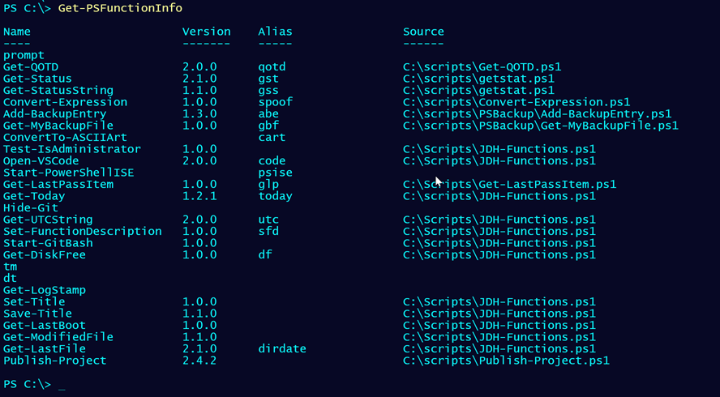

# PSFunctionInfo

[](https://www.powershellgallery.com/packages/PSFunctionInfo/) 

## Synopsis

This module contains a set of PowerShell commands to add and manage metadata in stand-alone PowerShell functions.

## Installation

You can install a __prelease__ version of this module from the PowerShell Gallery. You may need to update the PowerShellGet module to allow installing prerelease modules.

```powershell
Install-Module PSFunctionInfo -AllowPrerelease
```

The module should work on both Windows PowerShell and PowerShell 7.x, even cross-platform.

## Description

The purpose of this code is to provide a way to get versioning and other metadata information for functions that may not belong to a module. This is information you want to get after the function has been loaded into your PowerShell session. I have numerous stand-alone functions. These functions don't belong to a module, so there is no version or source information. However, I'd like to use that type of information for non-module files.

The code in this module isn't concerned with loading, running, or finding functions. By default, [Get-PSFunctionInfo](docs/Get-PSFunctionInfo.md) queries whatever is in the `Function:` PSDrive. If the PowerShell function belongs to a module, then you'll get the module version and source. Otherwise, you can use the function metadata.


The default behavior is to show all functions that __don't__ belong to a module.



You can also get functions by tag. Use `Get-PSFunctionInfoTag` to get a list of tags currently in use.


The PSFunctionInfo object includes a PropertySet called AuthorInfo.

```dos
PS C:\> Get-PSFunctionInfo -Tag modules | Select-Object -property AuthorInfo


Name        : Test-HelpLink
Version     : 0.9.0
Source      : C:\scripts\update-helplinks.ps1
CompanyName : JDH IT Solutions, Inc.
Copyright   : (c) JDH IT Solutions, Inc.
Description : Test if help file is missing the online link
LastUpdate  : 4/23/2021 9:21:00 AM
```

Finally, you can also search .ps1 files for PSFunctionInfo metadata.


## Creating PSFunctionInfo

Use the [New-PSFunctionInfo](docs/New-PSFunctionInfo.md) command to insert the metadata tag into your script file.

```powershell
New-PSFunctionInfo -Path c:\scripts\Test-ConsoleColors.ps1 -Description "show console color combinations" -Name Test-ConsoleColor -Author "Jeff Hicks" -CompanyName "JDH IT Solutions" -Copyright "2021 JDH IT Solutions, Inc." -Tags "scripting","console"
```

The default behavior is to insert the metadata tag immediately after the opening brace ({) into the file. **This command will update the file**. Or you can use the `ToClipBoard` parameter which will copy the metatadata to the clipboard and you can manually insert it into your script file that defines the function.

You should get something like this:

```text

<# PSFunctionInfo

Version 1.0.0
Author Jeff Hicks
CompanyName JDH IT Solutions
Copyright 2021 JDH IT Solutions, Inc.
Description show console color combinations
Guid 8e43a9d9-1df6-48c7-8595-7363087aba43
Tags scripting,console
LastUpdate 4/21/2021 10:43 AM
Source C:\scripts\Test-ConsoleColors.ps1

#>
```

This command not work with functions defined in a single line like this:

```powershell
Function Get-Foo { Get-Date }
```

You can still run `New-PSFunctionInfo` with the `ToClipboard` parameter and manually edit your function to insert the metadata.

```powershell
Function Get-Foo {

<# PSFunctionInfo

Version 1.0.0
Author Jeff Hicks
CompanyName JDH IT Solutions
Copyright 2021 JDH IT Solutions, Inc.
Description Get Foo Stuff
Guid 490595c6-6a0c-4572-baf4-f808c010de70
Tags scripting,console
LastUpdate 4/21/2021 10:4f AM
Source C:\scripts\FooStuff.ps1

#>
    Get-Date
}
```

There are no commands to modify or remove function metadata. It is assumed that when you update the function, you can update or remove the metadata.

### Backup

Because creating a PSFunctionInfo metadata comment block modifies the file, you might feel safer with a backup. `New-PSFuntionInfo` has a `-BackupParameter` which will create a backup copy of the source file before inserting the metadata comment block. The file will be created in the same directory, appending an extension of .bak1. If there are previous backups, the number will increment, i.e. .bak2. You can manually delete the backup files.

The `-Backup` parameter has no effect if you use `-Clipboard`.

## PSFunctionInfo Defaults

Because you might define function metadata often, and want to maintain consistency, you can define a set of default values for `New-PSFunctionInfo`. Use the command, [Set-PSFunctionInfoDefaults](docs/Set-PSFunctionInfoDefaults):

```powershell
Set-PSFunctionInfoDefaults -Tags "stand-alone" -Copyright "(c) JDH IT Solutions, Inc." -author "Jeff Hicks" -company "JDH IT Solutions, Inc."
```

The defaults will be stored in a JSON file at `$home\psfunctioninfo-defaults.json`. When you import this module, these values will be used to define entries in `$PSDefaultParameterValues`. Or, run [Update-PSFunctionInfoDefaults](docs/Update-PSFunctionInfoDefaults) to update parameter defaults.

You can use [Get-PSFunctionInfoDefaults](docs/Get-PSFunctionInfoDefaults.md) to see the current values.

## Editor Integration

When you import the module into an editor, you will get additional features to make it easier to insert PSFunctionInfo metadata into your file. It is recommended that you explicitly import the module into the editor's integrated console session. You could add an `Import-Module PSFunctionInfo` command into the editor's PowerShell profile script.

### Visual Studio Code

If you have an open file, in the integrated PowerShell console, you can run `New-PSFunctionfo` and press <kbd>TAB</kbd> to tab-complete the detected functions in the current file. The file path will automatically be detected. You can enter other values such as version, or simply press <kbd>ENTER</kbd> to insert the metadata, which you can then edit.


This example is taking advantage of saved defaults.

### PowerShell ISE

When you import the module in the PowerShell ISE, it will add a menu shortcut.


With a loaded file, you could run `New-PSFunctionInfo` in the console specifying the function name. The Path will be auto-detected. Or use the menu shortcut which will give you a graphical "function picker"


Select a function and click OK. The metadata block will be inserted into the file. This will not work with a file that has unsaved changes. When you insert new function metadata, the file in the ISE will be closed, re-opened, and focus should jump to the function.


## Background

This code is a prototype for a [suggestion](https://github.com/PowerShell/PowerShell/issues/11667) I made for PowerShell 7. Early versions of this code were published as [https://gist.github.com/jdhitsolutions/65070cd51b5cfb572bc6375f67bcbc3d](https://gist.github.com/jdhitsolutions/65070cd51b5cfb572bc6375f67bcbc3d "view the Github gist")

This module was first described at <https://jdhitsolutions.com/blog/powershell/8343/a-better-way-to-manage-powershell-functions/>.

## Roadmap

+ Add function metadata by file, autodetecting the function name.

Last Updated 2021-04-27 17:11:18Z
